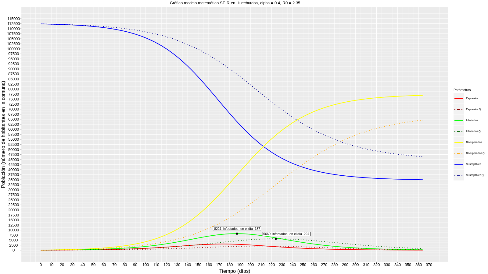

# MEMSEIRCHILE
Modelo epidemiológico SEIR en Chile

Plataforma web para la estimación de la necesidad de recursos médicos en regiones y comunas de Chile a través del modelo epidemiológico matemático SEIR en tiempo real.

El estudio de las enfermedades infecciosas a menudo se basa en modelos epidemiológicos matemáticos que intentan emular la dinámica de la enfermedad y estimar los parámetros relacionados con ella, como la tasa de reproducibilidad, velocidad de transmisión, fuerza de acción del gobierno, intensidad de reacción individual, entre otras.
Un tipo de simulación es el modelo SEIR basado en el supuesto de que la población se puede clasificar en cuatro grupos compartimentados independientes (individuos susceptibles, individuos expuestos, individuos infectados e individuos recuperados). Este modelo estudia de qué manera los individuos pueden progresar de un grupo compartimentado al siguiente.
Una nueva enfermedad causada por el coronavirus  SARS-CoV-2, identificada por primera vez en la ciudad de Wuhan y denominada COVID-19 por la Organización Mundial de la Salud, se ha propagado rápidamente a otras ciudades y países. En respuesta para controlar la epidemia, el gobierno chino ordenó una cuarentena de la ciudad de Wuhan el 23 de enero de 2020. Luego se procedió a analizar la efectividad de la cuarentena de la ciudad de Wuhan contra esta epidemia, se han estimado las dinámicas de transmisión de COVID-19 mediante el uso del modelo "susceptible expuesto a infeccioso recuperado" (SEIR) para describir la dinámica de la epidemia de COVID-19 en función de las características epidemiológicas de los individuos.

Este mismo modelo se pretende implementar en esta propuesta parametrizando los datos obtenidos de casos confirmados y sospechosos de COVID- 19 reportados en Chile. Se utilizará para estimar la dinámica de COVID-19 la información de regiones y comunas. Este modelo ayudará a la toma de desiciones, tanto para estimar la necesidad de recursos médicos de regiones y comunas, como la comparación entre efectuar y no efectuar un distanciamiento social, el cual también ayudará a hacer consciencia a la comunidad sobre lo importante que puede ser el hecho de quedarse en casa y de no exponerse a sí mismo y exponer a los demás a la enfermedad.

Se quiere crear una plataforma web en base al modelo epidemiológico matemático SEIR en Chile, sus regiones y las comunas de dichas regiones. Esta plataforma web utilizará las bases de datos otorgadas por el Ministerio de Ciencia y Tecnología junto a los datos entregados por el Ministerio de Salud de Chile y algunos parámetros otorgados por el Colegio Médico de Chile.

El propósito inicial de la plataforma web es la ayuda a la toma de decisiones para la distribución de implementos y de personal médico en las distintas localidades del país en base a las necesidades de éstas. Otro propósito es demostrar a la comunidad de manera científica y sencilla que la cuarentena puede ayudar a prevenir que aumenten drásticamente los casos de individuos enfermos para no sofocar el sistema de salud chileno.

 Ejemplo de gráfico del modelo epidemiológico matemático SEIR en la comuna de Huechuraba. En el eje “y” se encuentra la población, en el eje “x” los días (un año). En la cual se observan las curvas lineales que representan sin distanciamiento social y las curvas punteadas con distanciamiento social (en la leyenda inicia con “Q” haciendo referencia a la palabra en inglés “quarantine”). Uno de los análisis importantes del gráfico es que al hacer distanciamiento social ralentizaría (en 37 días) la velocidad de contagio, lo que ayudaría a no sofocar el sistema de salud. Otro análisis importante es el máximo de infectados, que se traduce a menos 2561 personas infectadas de las que se tendrán sin distanciamiento social.
